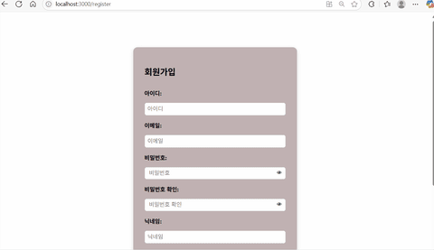
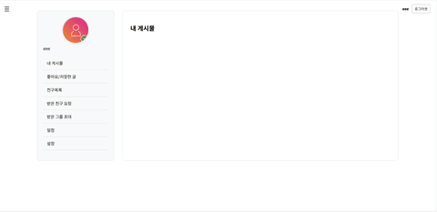
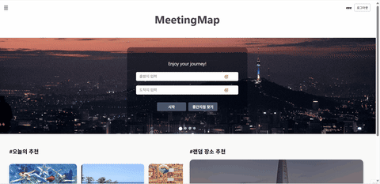

# MeetingMap

> 경로 기반 장소 추천 및 자동 스케줄링 플랫폼

약속 장소를 정할 때 "어디서 만날까?"라는 고민, 누구나 해봤을 것입니다.
MeetingMap은 여러 사람의 출발지를 입력하면 **중간 지점을 자동으로 찾아주고**, 그 주변의 맛집, 카페, 관광지 등을 **경로 기반으로 추천**해주는 서비스입니다.

추천받은 장소들로 **일정을 자동 생성**하거나, 직접 커스터마이징하여 나만의 스케줄을 만들 수 있습니다.

## 배포 URL
https://meeting-map.kro.kr

## 개발 기간
2025.03 ~ 2025.07 (5개월)

## 팀 구성
- 4인 팀 프로젝트
- 담당: **Backend 개발** (Spring Boot, REST API 설계, DB 설계, 외부 API 연동)

---

## 시연 영상

### 회원가입 / 로그인


> 일반 로그인과 카카오 OAuth 로그인 지원

### 메인페이지


> 오늘의 추천 게시글과 랜덤 장소 추천

### 지도 - 경로 탐색


> 출발지/도착지 입력 시 최적 경로 및 주변 장소 표시

### 지도 - 중간지점 탐색


> 최대 4개 출발지의 중간 지점 자동 계산

### 스케줄 생성


> AI 추천 또는 직접 장소 선택하여 일정 생성

### 게시판 / 글쓰기


> 카테고리별 게시판에서 장소 후기 공유

### 마이페이지


> 내가 작성한 글, 좋아요, 스크랩, 일정 관리

### 그룹 기능


> 그룹 생성 및 멤버와 일정 공유

---

## 기술 스택

### Backend


### Frontend


### External API


### Infra


---

## 주요 기능

### 1. 중간 지점 탐색
- 최대 4개의 출발지 입력 시 모든 인원이 만나기 좋은 중간 지점 자동 계산
- 각 출발지에서 중간 지점까지의 예상 소요 시간 표시

### 2. 경로 기반 장소 추천
- 선택한 위치 주변의 장소를 카테고리별로 필터링 (관광지, 음식점, 카페, 숙박 등)
- Kakao Maps, Google Places, Tour API 데이터를 통합하여 풍부한 장소 정보 제공
- 장소별 평점, 리뷰, 상세 정보 확인 가능

### 3. 스케줄 생성 및 관리
- **AI 추천 스케줄**: OpenAI API를 활용하여 선택한 장소들의 최적 방문 순서 추천
- **직접 생성**: 원하는 장소를 직접 추가/삭제하여 커스텀 일정 구성
- 이동 수단 선택 (차량 / 대중교통 / 도보) 및 예상 소요 시간 계산
- 생성된 스케줄 저장 및 수정

### 4. 경로 탐색
- TMap API 연동으로 실제 경로 및 소요 시간 계산
- 차량, 대중교통, 도보 3가지 이동 수단 지원
- 지도 위에 경로 폴리라인 시각화

### 5. 커뮤니티 (게시판)
- 카테고리별 게시판 운영 (공지사항, Q&A, 자유게시판)
- 이미지 첨부 기능 (AWS S3 연동)
- 좋아요, 싫어요, 스크랩, 댓글 기능

### 6. 그룹
- 그룹 생성 및 멤버 초대
- 그룹 내 스케줄 공유
- 그룹 전용 게시판

### 7. 소셜 기능
- 친구 추가/삭제, 친구 요청 관리
- 친구에게만 활동 공개 설정

### 8. 인증
- JWT 기반 인증
- 카카오 OAuth 2.0 로그인 지원

---

## 시스템 아키텍처

```
┌─────────────┐     ┌─────────────┐     ┌─────────────────────────────┐
│   Client    │────▶│   React     │────▶│      Spring Boot API        │
│  (Browser)  │     │  (Frontend) │     │         (Backend)           │
└─────────────┘     └─────────────┘     └──────────────┬──────────────┘
                                                       │
                    ┌──────────────────────────────────┼──────────────────────────────────┐
                    │                                  │                                  │
                    ▼                                  ▼                                  ▼
            ┌──────────────┐                  ┌──────────────┐                   ┌──────────────┐
            │    MySQL     │                  │   AWS S3     │                   │ External APIs│
            │  (Database)  │                  │   (Storage)  │                   │              │
            └──────────────┘                  └──────────────┘                   └──────────────┘
                                                                                        │
                                              ┌─────────────────────────────────────────┤
                                              │              │              │           │
                                              ▼              ▼              ▼           ▼
                                         Kakao API      TMap API     Google API    OpenAI API
                                                                                   Tour API
```

---

## 프로젝트 구조

```
meeting_map/
├── backend/
│   └── src/main/java/com/capstone/meetingmap/
│       ├── api/                    # 외부 API 연동
│       │   ├── kakao/              # 카카오 API (지도, 좌표)
│       │   ├── tmap/               # TMap API (경로 탐색)
│       │   ├── google/             # Google Places API
│       │   ├── tourapi/            # 공공데이터 Tour API
│       │   ├── openai/             # OpenAI API (AI 스케줄)
│       │   └── amazon/             # AWS S3 (파일 업로드)
│       ├── auth/                   # 인증 (로그인, JWT)
│       ├── user/                   # 회원 관리
│       ├── board/                  # 게시판
│       ├── comment/                # 댓글
│       ├── schedule/               # 스케줄
│       ├── group/                  # 그룹
│       ├── friendship/             # 친구
│       ├── map/                    # 지도/장소
│       ├── path/                   # 경로 탐색
│       ├── config/                 # 설정 (Security, WebClient 등)
│       └── jwt/                    # JWT 유틸리티
│
├── frontend/
│   └── src/
│       ├── pages/                  # 페이지 컴포넌트
│       │   ├── Home.jsx            # 메인 페이지
│       │   ├── Map.jsx             # 지도 페이지
│       │   ├── Schedule.jsx        # 스케줄 생성
│       │   ├── Board.jsx           # 게시판
│       │   ├── Group.jsx           # 그룹
│       │   ├── Mypage.jsx          # 마이페이지
│       │   └── Login.jsx           # 로그인
│       ├── components/             # 재사용 컴포넌트
│       └── utils/                  # 유틸리티 함수
│
├── docs/                           # API 문서
└── asset/                          # 시연 GIF
```

---

## DB 설계 (주요 엔티티)

| 엔티티 | 설명 |
|--------|------|
| User | 회원 정보 (일반/카카오) |
| Board | 게시글 |
| BoardFile | 게시글 첨부파일 |
| Comment | 댓글 |
| Schedule | 스케줄 |
| ScheduleDetail | 스케줄 상세 (장소별 시간) |
| Group | 그룹 |
| GroupMember | 그룹 멤버 |
| GroupBoard | 그룹 게시글 |
| Friendship | 친구 관계 |

---

## API 문서

| API | 설명 | 문서 |
|-----|------|------|
| User API | 회원가입, 정보 조회/수정, 탈퇴 | [UserAPI.md](docs/UserAPI.md) |
| Auth API | 로그인, 로그아웃, 카카오 인증 | [AuthAPI.md](docs/AuthAPI.md) |
| Board API | 게시글 CRUD, 좋아요, 스크랩 | [BoardAPI.md](docs/BoardAPI.md) |
| Comment API | 댓글 CRUD | [CommentAPI.md](docs/CommentAPI.md) |
| Map API | 장소 검색, 카테고리 조회 | [MapAPI.md](docs/MapAPI.md) |
| Path API | 경로 탐색 (차량/대중교통/도보) | [PathAPI.md](docs/PathAPI.md) |
| Schedule API | 스케줄 생성/저장/수정/삭제 | [ScheduleAPI.md](docs/ScheduleAPI.md) |
| Group API | 그룹 관리, 멤버 초대, 스케줄 공유 | [GroupAPI.md](docs/GroupAPI.md) |
| GroupBoard API | 그룹 게시판 | [GroupBoardAPI.md](docs/GroupBoardAPI.md) |
| Friendship API | 친구 추가/삭제/요청 관리 | [FriendshipAPI.md](docs/FriendshipAPI.md) |

---

## 로컬 실행 방법

### 사전 요구사항
- Java 17
- MySQL 8.0
- Node.js 18+

### Backend
```bash
cd backend

# 1. 환경 변수 설정
cp .env.example .env
# .env 파일에 실제 API 키 입력

# 2. 데이터베이스 생성
mysql -u root -p -e "CREATE DATABASE capstone_db"

# 3. 실행
./gradlew bootRun
```

### Frontend
```bash
cd frontend

# 1. 환경 변수 설정
cp .env.example .env
# .env 파일에 실제 API 키 입력

# 2. 의존성 설치
npm install

# 3. 실행
npm start
```

---

## 라이선스
이 프로젝트는 학습 목적으로 제작되었습니다.
